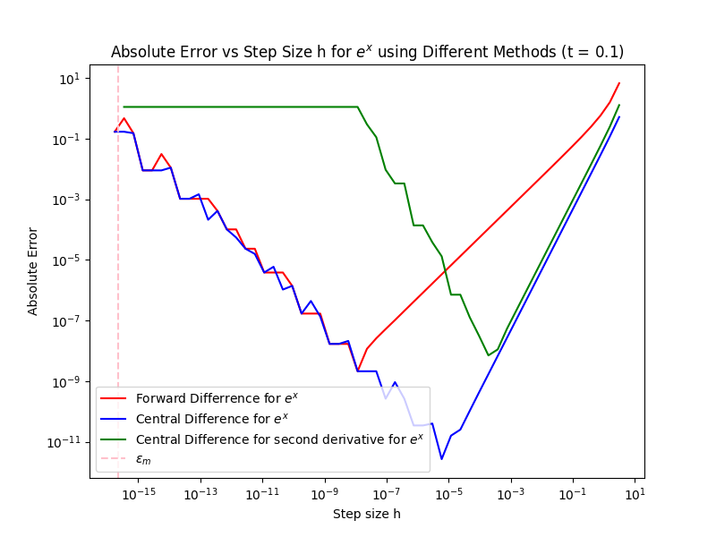

# datascience
Data science set up for Stefan Hutzler's Computer Simulations. 

Following this video [How to set up VS Coode for Data Science and AI](https://youtu.be/zulGMYg0v6U?feature=shared)

## Generated Plots

## Generated Plots

## Generated Plots
0.png)
Forward Differrence.png)
1.png)
Forward Differrence.png)
.png)

0.png)
Central Difference.png)
1.png)
Central Difference.png)
.png)

0.png)
Central Difference for second derivative.png)
1.png)
Central Difference for second derivative.png)
.png)

